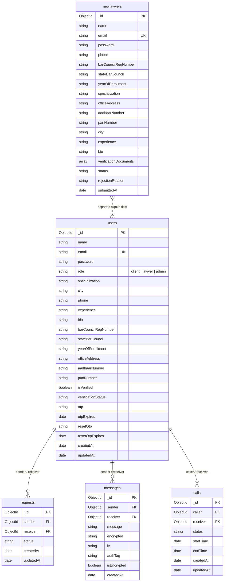

# Legal Reach — MongoDB Data Store & Schema

This document describes **how data is stored** in the Legal Reach project for reports and technical documentation. The backend uses **MongoDB** with the **Mongoose** ODM. Each Mongoose model maps to a **collection**; links between records use **ObjectId** references (`ref`), not SQL-style foreign keys.

**Source of truth:** `backend/models/*.js` (implemented collections).  
`PROJECT_DOCUMENTATION.md` also describes *planned* collections (Appointment, Document, Review) that are **not** present as model files in the codebase at this time.

---

## 1. Collections overview

| MongoDB collection (default naming) | Mongoose model | Purpose |
|-------------------------------------|----------------|---------|
| `users` | `User` | Clients, lawyers, admins; authentication, profiles, lawyer verification fields, OTP |
| `newlawyers` | `NewLawyer` | Lawyer registration pipeline with embedded verification documents |
| `requests` | `Request` | Connection/request between two users (e.g. client ↔ lawyer) |
| `messages` | `Message` | Chat messages; optional fields for encrypted payloads |
| `calls` | `Call` | Voice/video call session state between two users |

MongoDB pluralizes model names by default (e.g. model `User` → collection `users`).

---

## 2. Entity-relationship diagram (Mermaid)

Render this diagram in any Mermaid-compatible viewer (e.g. GitHub, VS Code Mermaid preview, or [mermaid.live](https://mermaid.live) for PNG/SVG export).

---

## 3. Collection: `users` (model: `User`)

**File:** `backend/models/user.js`

| Field | Type | Notes |
|-------|------|--------|
| `name` | String | Required |
| `email` | String | Required, unique |
| `password` | String | Required (hashed in application flow) |
| `role` | String | `client` \| `lawyer` \| `admin` (default: `client`) |
| `specialization` | String | Optional |
| `city` | String | Optional |
| `phone` | String | Optional |
| `experience` | String | Optional |
| `bio` | String | Optional |
| `barCouncilRegNumber` | String | Optional |
| `stateBarCouncil` | String | Optional |
| `yearOfEnrollment` | String | Optional |
| `officeAddress` | String | Optional |
| `aadhaarNumber` | String | Optional |
| `panNumber` | String | Optional |
| `isVerified` | Boolean | Default `false` |
| `verificationStatus` | String | `pending` \| `approved` \| `rejected` (default: `pending`) |
| `otp` | String | OTP for verification flows |
| `otpExpires` | Date | |
| `resetOtp` | String | Password reset flow |
| `resetOtpExpires` | Date | |
| `createdAt`, `updatedAt` | Date | Added via `{ timestamps: true }` |

---

## 4. Collection: `newlawyers` (model: `NewLawyer`)

**File:** `backend/models/NewLawyer.js`

| Field | Type | Notes |
|-------|------|--------|
| `name` | String | Required |
| `email` | String | Required, unique |
| `password` | String | Required |
| `phone` | String | Required |
| `barCouncilRegNumber` | String | Required |
| `stateBarCouncil` | String | Required |
| `yearOfEnrollment` | String | Required |
| `specialization` | String | Required |
| `officeAddress` | String | Required |
| `aadhaarNumber` | String | Optional |
| `panNumber` | String | Optional |
| `city` | String | Optional |
| `experience` | String | Optional |
| `bio` | String | Optional |
| `verificationDocuments` | Array of subdocuments | See below |
| `status` | String | `pending` \| `approved` \| `rejected` (default: `pending`) |
| `rejectionReason` | String | Optional |
| `submittedAt` | Date | Default now |

### Embedded: `verificationDocuments[]`

| Sub-field | Type | Notes |
|-----------|------|--------|
| `documentType` | String | Required: `sanad` \| `cop` \| `aadhaar` \| `pan` \| `governmentId` \| `other` |
| `documentUrl` | String | Required |
| `publicId` | String | e.g. cloud storage public id |
| `uploadedAt` | Date | Default now |

---

## 5. Collection: `requests` (model: `Request`)

**File:** `backend/models/Request.js`

| Field | Type | Notes |
|-------|------|--------|
| `sender` | ObjectId | Ref: `User`, required |
| `receiver` | ObjectId | Ref: `User`, required |
| `status` | String | `pending` \| `accepted` \| `rejected` (default: `pending`) |
| `createdAt`, `updatedAt` | Date | Timestamps |

---

## 6. Collection: `messages` (model: `Message`)

**File:** `backend/models/Message.js`

| Field | Type | Notes |
|-------|------|--------|
| `sender` | ObjectId | Ref: `User`, required |
| `receiver` | ObjectId | Ref: `User`, required |
| `message` | String | Required (plaintext or handling depends on app) |
| `encrypted` | String | Optional ciphertext |
| `iv` | String | Optional initialization vector |
| `authTag` | String | Optional auth tag |
| `isEncrypted` | Boolean | Default `true` |
| `createdAt` | Date | Default now |

---

## 7. Collection: `calls` (model: `Call`)

**File:** `backend/models/Call.js`

| Field | Type | Notes |
|-------|------|--------|
| `caller` | ObjectId | Ref: `User`, required |
| `receiver` | ObjectId | Ref: `User`, required |
| `status` | String | `pending` \| `accepted` \| `rejected` \| `ended` (default: `pending`) |
| `startTime` | Date | Optional |
| `endTime` | Date | Optional |
| `createdAt`, `updatedAt` | Date | Timestamps |

---

## 8. Documented but not implemented as models

The following appear in `PROJECT_DOCUMENTATION.md` as design examples but **do not** exist under `backend/models/` in this repository:

- **Appointment** — booking slots, payment status, meeting links, etc.
- **Document** — generic file metadata tied to users/appointments.
- **Review** — ratings tied to lawyers and appointments.

Use this section in reports to distinguish **current implementation** (Sections 1–7) from **roadmap / documentation** (this section).

---

## 9. Exporting this document to PDF

- **From VS Code / Cursor:** Open this file, use Markdown preview, then **Print** → **Save as PDF**.
- **From Pandoc (if installed):**  
  `pandoc DATABASE_SCHEMA.md -o DATABASE_SCHEMA.pdf`
- **Mermaid figure:** Paste the diagram from Section 2 into [mermaid.live](https://mermaid.live) and export PNG/SVG for insertion into Word or slides.

---

*Generated for Legal Reach project documentation. Align with `backend/models/` when schemas change.*
